# FDA  Submission

**Your Name: Matthew Kennedy**

**Name of your Device: NN for Pneumonia Detection from Chest X-Rays**

## Algorithm Description 

### 1. General Information

**Intended Use Statement: This algorithm is used to aid Radiologists in detecting pneumonia in a chest x-ray.** 

**Indications for Use: To improve turnaround time for diagnosing patients, a Radiologist will send the dicom file to the algorithm and will be presented with the algorithms prediction of pneumonia or no pneumonia. The model is to be used on chest x-rays with a modality of DX and a patient position of either AP or PA. Since the model was trained on data with the majority of patient ages ranging from thirty to sixty, the model should be used on patients in this range and may be less accurate outside of this range. The model can be used on patients of male or female gender. Note that this age range is based off of the EDA that shows a Pneumonia Patient Age Distribution with mean of 44 and std of 17.**

**Device Limitations: This should not be used as a diagnostic device - it is ultimately up to the Radiologist to make the diagnosis. The model should be limited to age ranges of thirty to sixty, but does not need to be limited to any comorbidities. The model took an hour to train in the virtual GPU workspace provided, so the time cost of training should be considered when someone is deciding whether to re-train or not.**

**Clinical Impact of Performance: Improved turnaround time for diagnosing patients.**

### 2. Algorithm Design and Function

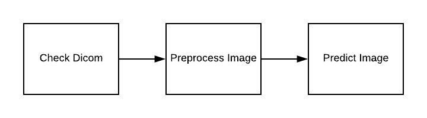

**DICOM Checking Steps:**
Ensure BodyPartExamined is CHEST
Ensure Modality is DX
Ensure PatientPosition is either AP or PA

**Preprocessing Steps:**
resize dicom pixel_array

**CNN Architecture:**
Pretrained VGG16 model with the first sixteen layers frozen (not trainable) with an additional four dense layers and dropout layers.

### 3. Algorithm Training

**Parameters:**
* Types of augmentation used during training
keras ImageDataGenerator with metrics (rescale=1. / 255.0, horizontal_flip = True, vertical_flip = False, height_shift_range= 0.1, width_shift_range=0.1, rotation_range=20, shear_range = 0.1,zoom_range=0.1)
* Batch size
9
* Optimizer learning rate
Adam optimizer with lr=1e-4
* Layers of pre-existing architecture that were frozen
16
* Layers of pre-existing architecture that were fine-tuned
2
* Layers added to pre-existing architecture
4

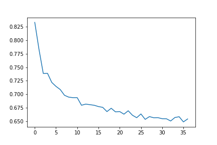

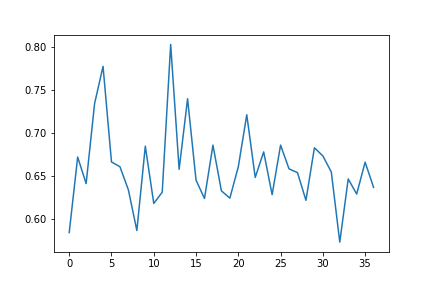

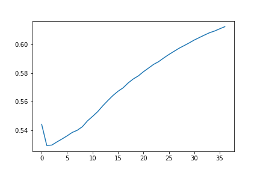

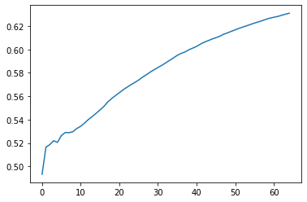

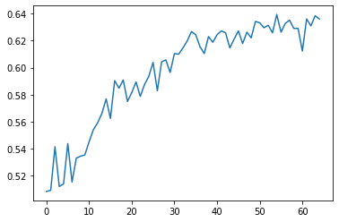

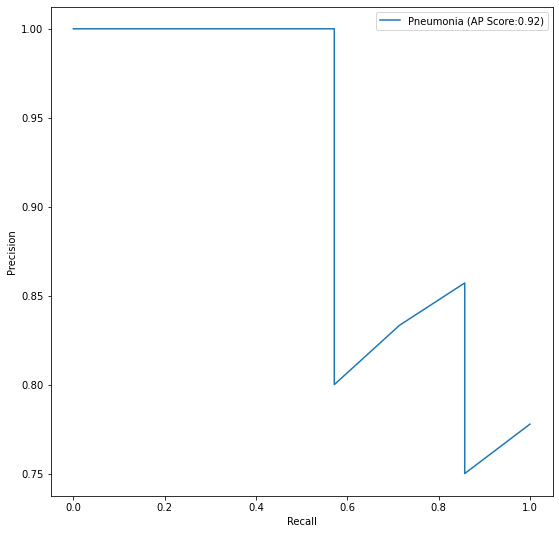

Regarding the tradeoff between precision and recall, recall is preferred in this context in order to reduce the amount of false negatives - we do not want the radiologist to diagnose a pneumonia patient as non-pneumonia!

**Final Threshold and Explanation:**

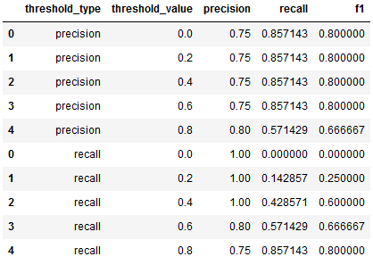

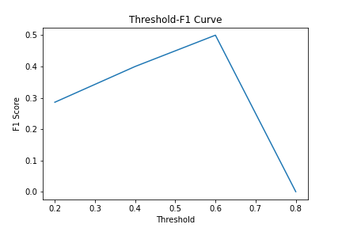

Using precision threshold of 0.6 yielded a precision of .5, a recall of .5, and an f1 score of .5. This will be used as my threshold since it has the highest f1 score of all the attempts as well as the highest recall.

### 4. Databases

"Chest X-ray exams are one of the most frequent and cost-effective medical imaging examinations available. However, clinical diagnosis of a chest X-ray can be challenging and sometimes more difficult than diagnosis via chest CT imaging. The lack of large publicly available datasets with annotations means it is still very difficult, if not impossible, to achieve clinically relevant computer-aided detection and diagnosis (CAD) in real world medical sites with chest X-rays. One major hurdle in creating large X-ray image datasets is the lack resources for labeling so many images. Prior to the release of this dataset, Openi was the largest publicly available source of chest X-ray images with 4,143 images available." 

For the training set, 1073 pneumonia patients and 1073 non-pneumonia patients. For the validation set, a ratio of positive to negative of 1:3 was used, resulting in 358 pneumonia patients and 1074 non-pneumonia patients. The reason for the 1:3 ratio for the validation set is due to the fact that in a real clinical setting, the population of non-pneumonia patients will outweigh the pneumonia patients. For the distributions of this data, please see the visualizations below.

**Description of Training Dataset:** 
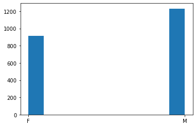
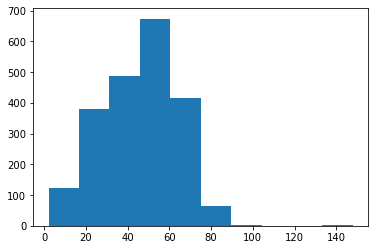
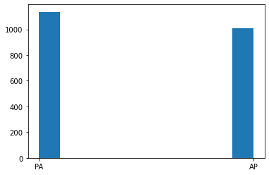
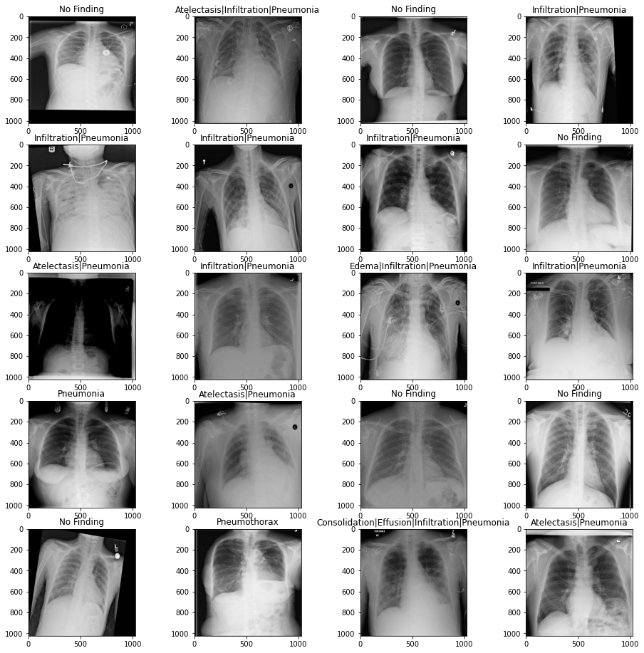
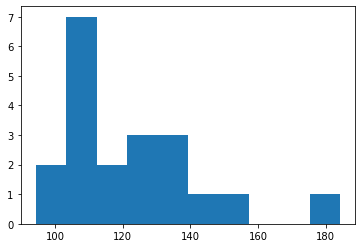
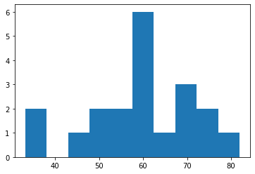

**Description of Validation Dataset:** 
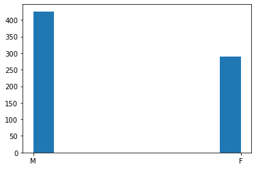
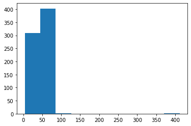
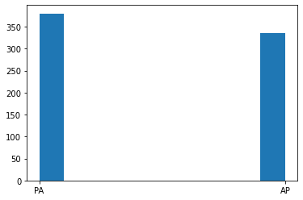
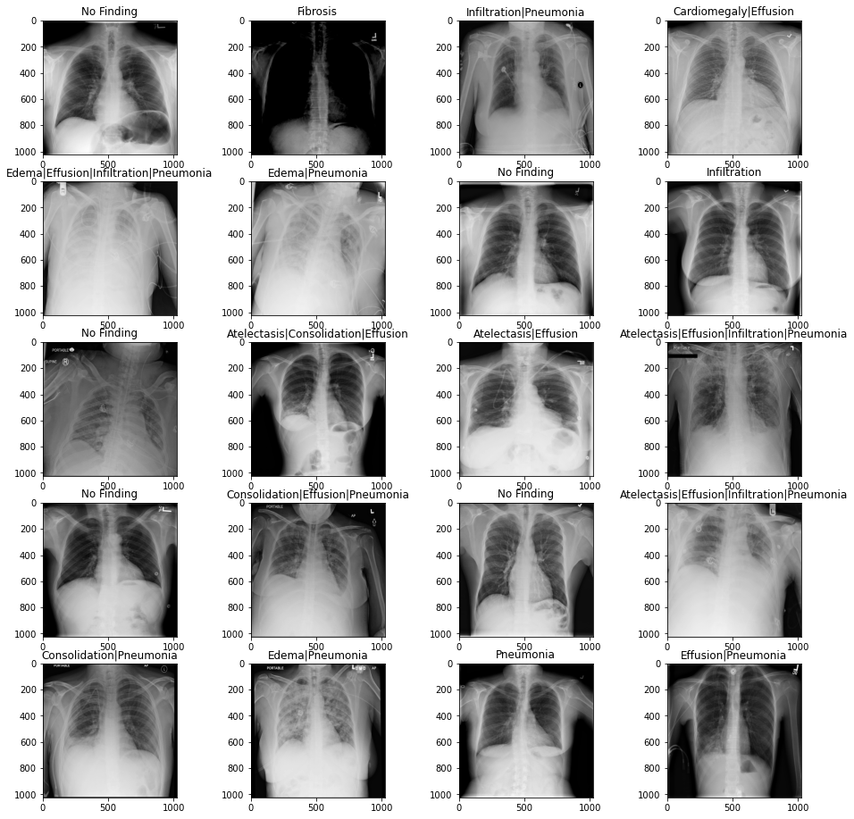
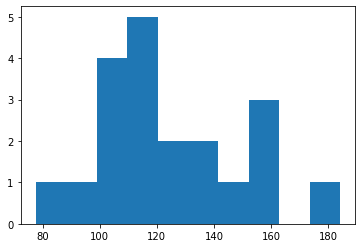
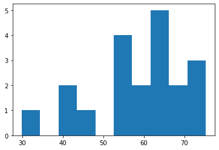

### 5. Ground Truth

"This NIH Chest X-ray Dataset is comprised of 112,120 X-ray images with disease labels from 30,805 unique patients. To create these labels, the authors used Natural Language Processing to text-mine disease classifications from the associated radiological reports. The labels are expected to be >90% accurate and suitable for weakly-supervised learning." 

One advantage for this approach is that it was automated and therefore did not require humans to read through the data and create the labels. A disadvantage is that it relies on NLP to create the labels, which are expected to be >90% accurate.

The data comes from the NIH. The 'Findings Label' from the dataset was used. More specifically, a new feature was created that was a boolean for whether or not 'Pneumonia' was contained in the 'Finding Labels' column for that patient. This feature, "pneumonia_class" will be used as the gold standard. 

### 6. FDA Validation Plan

**Patient Population Description for FDA Validation Dataset:**

See Section 4 Description of Validation Dataset

**Ground Truth Acquisition Methodology:**

See Section 5 Ground Truth

**Algorithm Performance Standard:**

Ideally, the validation dataset from a clinical partner would be the DICOM files of x-rays with the findings (ground truth / silver standard) having been intentionally recorded by the radiologist rather than extracted via NLP. These findings should be the result of multiple radiologists as well as biopsies, and the final label should be a weighted result of all radiologists findings to create a single label for each image. The validation dataset should be chest x-rays with a modality of DX and a patient position of either AP or PA.  The validation dataset should have patient ages ranging from thirty to sixty and may be male or female.

From the , we can see that the AUCs of ROC curves for multi-label classification had the following values for detecting Pneumonia: AlexNet:.5493, GoogLeNet: .5990, VGGNet-16: .5100, ResNet-50: .6333. Since our model was built off of the VGGNet, the model should be held to the same standard as the one from this paper. Since the model achieved an AUC of >.62, it should be considered as sufficient in this setting. However, one should note that our model was binary classification, and the models from the paper are multi-label classification.

Additionally,  shows an average Radiologist F1 score of .387 and the paper's CheXNet F1 score of .435. Our model should be held to the standards of at least the average Radiologist F1 score, which our model surpasses with a value of .5.