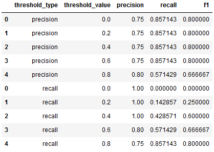
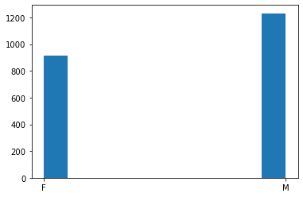
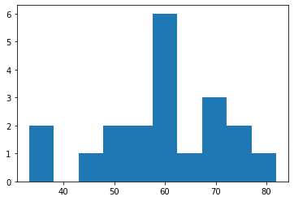
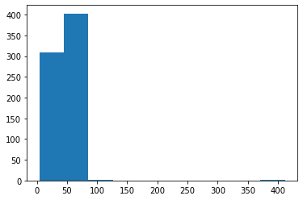
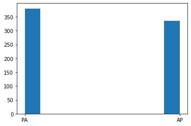
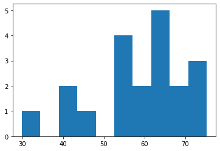

# FDA  Submission

**Your Name: Matthew Kennedy**

**Name of your Device: NN for Pneumonia Detection from Chest X-Rays**

## Algorithm Description 

### 1. General Information

**Intended Use Statement: This algorithm is used to aid Radiologists in detecting pneumonia in a chest x-ray.** 

**Indications for Use: To improve turnaround time for diagnosing patients, a Radiologist will send the dicom file to the algorithm and will be presented with the algorithms prediction of pneumonia or no pneumonia.**

**Device Limitations: This should not be used as a diagnostic device - it is ultimately up to the Radiologist to make the diagnosis.**

**Clinical Impact of Performance: Improved turnaround time for diagnosing patients.**

### 2. Algorithm Design and Function

<< Insert Algorithm Flowchart >>
Flowchart: check_dicom -> preprocess_image -> predict_image

**DICOM Checking Steps:**
Ensure BodyPartExamined is CHEST
Ensure Modality is DX
Ensure PatientPosition is either AP or PA

**Preprocessing Steps:**
resize dicom pixel_array

**CNN Architecture:**
Pretrained VGG16 model with the first sixteen layers frozen (not trainable) with an additional four dense layers and dropout layers.

### 3. Algorithm Training

**Parameters:**
* Types of augmentation used during training
keras ImageDataGenerator with metrics (rescale=1. / 255.0, horizontal_flip = True, vertical_flip = False, height_shift_range= 0.1, width_shift_range=0.1, rotation_range=20, shear_range = 0.1,zoom_range=0.1)
* Batch size
9
* Optimizer learning rate
Adam optimizer with lr=1e-4
* Layers of pre-existing architecture that were frozen
16
* Layers of pre-existing architecture that were fine-tuned
2
* Layers added to pre-existing architecture
4

**Final Threshold and Explanation:**

Using precision threshold of 0.6 yielded a precision of .75, a recall of .86, and an f1 score of .80. This will be used as my threshold since it has the highest f1 score of all the attempts as well as the highest recall.

### 4. Databases

An equal number of patients that had pneumonia or non-pneumonia was used for a total size of 2862 patients. A train_test_split of .25 was used, resulting in 2146 training patients and 716 testing patients.

**Description of Training Dataset:** 

**Description of Validation Dataset:** 

### 5. Ground Truth

The data comes from the NIH. The 'Findings Label' from the dataset was used. More specifically, a new feature was created that was a boolean for whether or not 'Pneumonia' was contained in the 'Findings Label' column for that patient. .

### 6. FDA Validation Plan

**Patient Population Description for FDA Validation Dataset:**
See Section 4 Description of Validation Dataset

**Ground Truth Acquisition Methodology:**
See Section 5 Ground Truth

**Algorithm Performance Standard:**
If any of recall, precision, or f1 scores were to drop ten percent from the benchmarks of .86, .75, and .80, respectively (benchmarks from this project), the algorithm should be reviewed and improved upon. .
